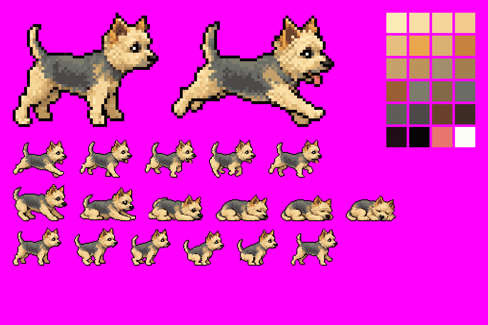

# mod-ferro



A Claude Code mod for the Code tab of Claude Desktop. When Claude works on a turn for longer than 20 seconds, a band opens above the prompt and Ferro, a Norwich Terrier, runs across a pixel-art meadow:

- each turn picks the summer or the autumn meadow at random (a winter meadow is built but switched off for now)
- the meadow has three layers (clouds, hills with trees, grass) that scroll at different speeds
- in about a third of the turns an orange ball bounces ahead of her and she chases it; when she stops to poop it rolls on and waits on the grass until she reaches it
- roughly every 40 seconds Ferro poops the way the real Ferro does: hunched, walking slowly forward, leaving a row of droppings that scrolls away with the grass (in about one turn in five she stops and poops in one spot instead)
- after 3 minutes Ferro lies down and falls asleep





When the turn ends, the band disappears. Nothing is interactive, so there is nothing to miss when you are not looking.

## How it is built

**Art.** ChatGPT drew the frames (run, poop and sleep as 6-frame strips, the hunched walk as a 4-frame strip with three droppings, all on a magenta background) and the three meadows. `tools/build.py` turns them into real pixel art: it cuts the frames, removes the magenta, snaps them to a true pixel grid, maps every pixel to a frozen 22-colour palette (`assets/palette.json`, plus reserved colours for the tongue and the eye highlight), cleans the outline and aligns all frames on the ear and the ground line. The sleeping breath is derived in code from one frame, so the pose never jumps. Each meadow is split into its three layers, and the clouds get their own small palette so their light-blue shading survives. Colours the meadow palette misses by far get extra slots, which keeps the brown trunks of the winter trees brown.



**Rendering.** The Desktop band can draw an `Svg` element, but it does not render `<image>` with PNG data, so every frame is converted to vector strokes: one `<path>` per colour, one stroke per horizontal run of pixels, defined once in `<defs>` and placed with `<use>`. All animation is SMIL inside the SVG, so the mod draws the scene once and the browser engine animates it. `tools/scene.py` builds both scenes for each meadow into `plugin/hooks/scene.ts` and `preview/`.

**Constraints that shaped it.**
- The `Svg` element accepts at most 131,072 characters. The running scene is about 118k (110k with pooping in one spot) and the sleeping scene about 85k on the summer and autumn meadows; the ball adds about 6k, and the more detailed winter meadow about 7k. The ball is a separate piece of SVG the mod inserts into the plain scene, so the scenes are not stored twice.
- The loop is seamless: in one loop the ground travels exactly 20 meadow widths and the hills, at 0.35 of the ground speed, exactly 7.
- ChatGPT returned the gallop frames out of phase order, which made Ferro look like she was running backwards. The real order is `[4, 3, 2, 5, 0]`.

**The mod.** `plugin/hooks/register.tsx` starts two timers on `turn.start` (20 s to run, 3 min to sleep), clears them on the main turn's `turn.complete`, keeps the phase in `$.state` and draws the band with a `ui.render` hook on `AbovePrompt`, only on the desktop surface.

## Install

```bash
claude plugin marketplace add <path-to-this-repo>
claude plugin install mod-ferro@mod-ferro --scope user
```

Function hooks of installed plugins may need `"CLAUDE_CODE_ENABLE_FUNCTION_HOOKS": "1"` in the `env` block of `~/.claude/settings.json`. It works only in the Code tab of Claude Desktop, because the terminal has no `Svg` element.

Check and test: `claude plugin validate ./plugin` and `claude plugin test ./plugin`.
