# cc-mod-ferro



A Claude Code mod for the Code tab of Claude Desktop. When Claude works on a turn for longer than 20 seconds, a band opens above the prompt and Ferro, a Norwich Terrier, runs across a pixel-art meadow. When the turn ends, the band disappears. Nothing is interactive, so there is nothing to miss when you are not looking.

## What Ferro does

Every turn picks a meadow, what Ferro does 16 seconds into the run, and whether she chases a ball, all at random. The scenes below loop the same way the band does, so each one shows its moment 16 seconds in.

**Sits down and looks at you** (60% of the turns). She brakes, sits, turns her head to you, blinks, tilts her head, turns back and runs on.



**Poops while walking** (30% of the turns), the way the real Ferro does: hunched, walking slowly forward, leaving a row of droppings that scrolls away with the grass.


**Poops in one spot** (10% of the turns), the rare way.



**Chases an orange ball** (a third of the turns, on top of the above). The ball bounces ahead of her; when she stops, it rolls on and waits on the grass until she reaches it, then pops up again.



**Falls asleep** after 3 minutes. She lies down and breathes, and z's rise above her head.


**The meadow** is summer or autumn, in three layers (clouds, hills with trees, grass) that scroll at different speeds. A winter meadow is built but switched off for now.



## How it is built

**Art.** ChatGPT drew the frames (run, poop, sleep and sit as 6-frame strips, the hunched walk as a 4-frame strip with three droppings, all on a magenta background) and the three meadows. `tools/build.py` turns them into real pixel art: it cuts the frames, removes the magenta, snaps them to a true pixel grid, maps every pixel to a frozen 22-colour palette (`assets/palette.json`, plus reserved colours for the tongue and the eye highlight), cleans the outline, keeps one highlight in each eye and aligns the frames on the ground line and on the ear, or on the front paws where the head turns. ChatGPT drew some strips at a different scale than asked, so each strip has its own factor that gives Ferro the same head size everywhere. The sleeping breath and the blink while she sits are derived in code from one frame, so the pose never jumps. The orange ball is drawn in code. Each meadow is split into its three layers, and the clouds get their own small palette so their light-blue shading survives. Colours the meadow palette misses by far get extra slots, which keeps the brown trunks of the winter trees brown.


The reference sheet above goes into every ChatGPT request for new frames, so new drawings keep the same Ferro. The instructions and the prompts that produced each strip are in `assets/ref/chatgpt-project.md`.

**Rendering.** The Desktop band can draw an `Svg` element, but in the sandboxed frame the mod draws it in (`isInteractive`) it does not render `<image>` with PNG data, so every frame is converted to vector strokes: one `<path>` per colour, one stroke per horizontal run of pixels, defined once in `<defs>` and placed with `<use>`. All animation is SMIL inside the SVG, so the mod draws the scene once and the browser engine animates it. `tools/scene.py` builds the three running scenes and the sleeping scene for each meadow into `plugin/hooks/scene.ts` and `preview/`.

**Constraints that shaped it.** The facts about Claude Code and the Desktop band behind them, with the build and the date they were last checked, are in [`docs/desktop-band.md`](docs/desktop-band.md).
- The `Svg` element accepts at most 131,072 characters. On the summer and autumn meadows the running scenes are about 118k (pooping while walking), 114k (sitting) and 110k (pooping in one spot), and the sleeping scene about 85k; the ball adds about 6k, and the more detailed winter meadow about 7k. That is why sitting is a scene of its own instead of an extra moment in a running scene.
- The ball is a separate piece of SVG the mod inserts into the plain scene, so no scene is stored twice.
- The loop is seamless: in one loop the ground travels exactly 20 meadow widths and the hills, at 0.35 of the ground speed, exactly 7.
- ChatGPT returned the gallop frames out of phase order, which made Ferro look like she was running backwards. The real order is `[4, 3, 2, 5, 0]`.

**The mod.** `plugin/hooks/register.tsx` starts two timers on `turn.start` (20 s to run, 3 min to sleep) and picks the turn's meadow, running scene (60-30-10) and ball (one in three), keeping all of it in `$.state`. The timers are cleared on the main turn's `turn.complete`. The band is drawn with a `ui.render` hook on `AbovePrompt`, only on the desktop surface. Ferro is only a pastime, so she gives the band up to any other mod that has something to show there (the files a delete prompt is about, for one): the hook asks the plugins beneath first and draws only when the band would otherwise be empty.

## Install

```bash
claude plugin marketplace add <path-to-this-repo>
claude plugin install cc-mod-ferro@cc-mod-ferro --scope user
```

Function hooks of installed plugins may need `"CLAUDE_CODE_ENABLE_FUNCTION_HOOKS": "1"` in the `env` block of `~/.claude/settings.json`. It works only in the Code tab of Claude Desktop: the band above the prompt exists only there and in the terminal, and the terminal has no `Svg` element.

Check and test: `claude plugin validate ./plugin` and `claude plugin test ./plugin`.
